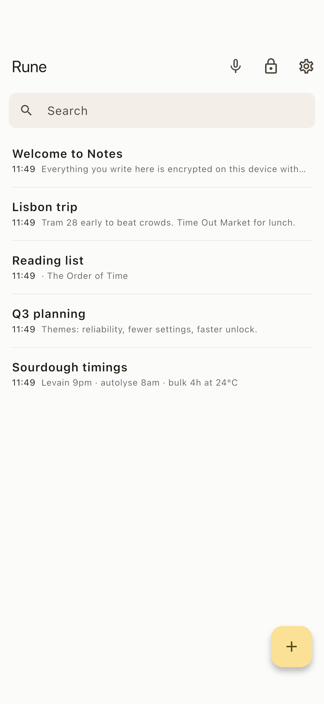

# Rune — a private, local-first, encrypted notes app

[](https://github.com/rorystandley/rune/actions/workflows/ci.yml)

<p align="center"></p>

A simple, fast, calm notes app in the spirit of Apple Notes, built for people
who don't trust apps with their data. Notes never leave your device, are
encrypted at rest with modern authenticated encryption, and the app makes **no
network calls at all**.

> **Status: working MVP.** Core vault engine, encryption, notes CRUD, search,
> auto-lock, backup/export, and the voice-note flow are implemented and tested.
> On-device speech-to-text is wired through a clean adapter with a clearly
> marked **stub** (see [Voice transcription](#voice-transcription)). This is not
> audited software — see [SECURITY.md](SECURITY.md) for honest limitations.

---

## Why this stack

**Flutter + a pure-Dart core.** The brief asked for one maintainable codebase
targeting macOS, Windows, Linux, iOS, and Android. Flutter is the least exotic
way to get there for a solo developer: one language, one UI toolkit, five
targets, no per-platform UI rewrites.

The important architectural decision is the split:

- **`packages/notes_core/`** — a **pure-Dart** package (no Flutter, no network,
  no logging of secrets) that contains *all* crypto, storage, and note logic.
  Because it has no Flutter dependency, its tests run under plain `dart test`
  with no device, emulator, or platform SDK. This is where the security lives
  and where the security tests run.
- **`app/`** — a thin Flutter UI layer that depends on `notes_core`. It owns
  screens, state, and platform glue (file paths, microphone) only.

This keeps the security-critical code small, dependency-light, auditable, and
portable (it could back a CLI or a server later without changes).

**Cryptography:** the [`cryptography`](https://pub.dev/packages/cryptography)
package — a well-known, pure-Dart implementation of standard primitives. We use
it for **Argon2id** (key derivation) and **XChaCha20-Poly1305** (authenticated
encryption). We do **not** implement any cryptographic primitive ourselves.

See [SECURITY.md](SECURITY.md) for the full crypto design and threat model.

---

## How it works (architecture)

### Envelope encryption

```
passphrase ──Argon2id(salt, 64 MiB, 3 passes)──▶ KEK (key-encryption key)
                                                  │
random 32-byte DEK (data key) ──encrypt with KEK─┘──▶ "wrapped key" (stored)

each note ──encrypt with DEK (XChaCha20-Poly1305, random nonce)──▶ .note file
```

- The passphrase derives a **key-encryption key (KEK)** via Argon2id.
- A random **data-encryption key (DEK)** is generated once per vault and stored
  only in *wrapped* (encrypted-under-KEK) form.
- Notes are encrypted with the DEK.
- **Changing the passphrase only re-wraps the DEK** — notes are never
  re-encrypted, and the design never paints us into a corner.
- A **wrong passphrase** produces a wrong KEK, which fails the wrapped key's
  authentication tag → unlock is rejected. (Proven by tests.)

### On-disk layout

```
<app-support>/notes_app/
├── vault/
│   ├── vault.json        # NON-secret header: KDF params + salt, cipher id, wrapped DEK
│   └── notes/
│       ├── 5f3a…1c.note  # AEAD blob: nonce || ciphertext || MAC  (filename = random id)
│       └── …
├── settings.json         # NON-secret: auto-lock timeout, toggles (no secrets)
└── audio_tmp/            # transient voice recordings (deleted by default)
```

Only ciphertext is ever written for note content. Writes are atomic
(temp-file + rename) to survive crashes. See
[what metadata remains visible](SECURITY.md#what-metadata-leaks).

### App layers

| Layer | Location | Responsibility |
|------|----------|----------------|
| Crypto | `notes_core/src/crypto` | Argon2id, XChaCha20-Poly1305, wrap/unwrap, secure RNG |
| Models | `notes_core/src/models` | `Note`, `VaultMetadata`, `KdfParams` |
| Storage | `notes_core/src/storage` | `VaultStore` interface + `FileVaultStore` |
| Services | `notes_core/src/services` | `VaultService`, `NotesRepository`, `ExportService` |
| Transcription | `notes_core/src/transcription` | `TranscriptionService` + stub |
| State | `app/lib/state` | `AppController` (lock state machine, auto-lock) |
| UI | `app/lib/ui` | create/unlock/home/editor/settings, voice sheet |

---

## Setup, build, run

### Prerequisites

- Flutter SDK 3.44+ (Dart 3.12+). Install from <https://flutter.dev> or, on
  macOS, `brew install --cask flutter`.
- For device/desktop builds you also need the platform toolchain (Xcode for
  macOS/iOS, Android SDK for Android, GTK/CMake for Linux, Visual Studio for
  Windows). **None of these are needed to run the tests.**

### Get dependencies

```bash
# Core package (pure Dart)
cd packages/notes_core && dart pub get && cd -

# Flutter app
cd app && flutter pub get
```

### Run the app

```bash
cd app
flutter run                 # pick a connected device / running desktop target
flutter run -d macos        # example: macOS desktop (requires Xcode)
flutter run -d linux        # example: Linux desktop
```

### Build a release

```bash
cd app
flutter build macos         # or: ios, apk, appbundle, linux, windows
```

> The app code targets all five platforms. In a headless CI box with no Xcode /
> Android SDK you can still run the full test suite (below) and `flutter
> analyze`; you just can't produce device binaries there.

---

## Testing

The security guarantees are backed by tests. Quick version:

```bash
# Core security + logic tests (no Flutter needed)
cd packages/notes_core && dart test

# App state + widget tests
cd app && flutter test
```

What's covered (encryption round-trips, wrong-passphrase rejection, CRUD,
search, export behaviour, no-plaintext-at-rest, no-secret-logging) is described
in [TESTING.md](TESTING.md).

These exact checks — `dart analyze` + `dart test` for the core, and `flutter
analyze` + `flutter test` for the app — run in
[GitHub Actions](.github/workflows/ci.yml) on every push and pull request, so
the security tests pass publicly on each commit (see the CI badge above).

---

## What's complete / stubbed / todo

### Complete and tested
- First-launch vault creation with passphrase + irreversibility warning.
- Lock / unlock; app starts locked if a vault exists; manual lock; auto-lock on
  inactivity; lock-on-background.
- Argon2id + XChaCha20-Poly1305 envelope encryption; encrypted at rest.
- Wrong passphrase cannot decrypt (test-proven).
- Notes: create, edit (autosave), delete, list, local search.
- Encrypted backup export; plaintext export gated behind explicit confirmation.
- Settings screen with the privacy posture, auto-lock, change passphrase.
- Responsive Apple-Notes-style UI (two-pane desktop, single-pane mobile).
- Voice note flow: record locally → transcribe → insert into a note → **delete
  raw audio by default**.

### Stubbed (clearly marked, honest)
- **Local speech-to-text.** Audio *recording* is real (`record`, 16 kHz mono
  WAV). *Transcription* uses `StubTranscriptionService`, which inserts a plainly
  labelled placeholder instead of fabricating a transcript. The real engine
  drops in behind the same `TranscriptionService` interface — see
  [docs/transcription.md](docs/transcription.md) for exactly how to wire in
  whisper.cpp.

### Not done yet (see [ROADMAP.md](ROADMAP.md))
- Native file picker / share sheet for exports (currently saved to a documented
  path).
- Optional native crypto acceleration (`cryptography_flutter`) for faster
  Argon2id on mobile.
- Metadata-hardening (size padding), biometric unlock, encrypted attachments.

---

## Privacy at a glance

- **No** telemetry, analytics, crash reporting, or tracking.
- **No** network calls in normal use. No account, no cloud, no third parties.
- Flutter's own tooling analytics were disabled during development
  (`flutter --disable-analytics`); the app ships no analytics of any kind.

Full commitments: [PRIVACY.md](PRIVACY.md). Threat model and limits:
[SECURITY.md](SECURITY.md).

## License

Licensed under the **GNU General Public License v3.0** — see [LICENSE](LICENSE).

Copyright © 2026 Rory Standley.

This is free software: you may redistribute and/or modify it under the terms of
the GPLv3. It comes with **no warranty**. Contributions are welcome — see
[CONTRIBUTING.md](CONTRIBUTING.md), which covers how contributions interact with
app-store distribution. Distribution/packaging notes live in [RELEASE.md](RELEASE.md).
