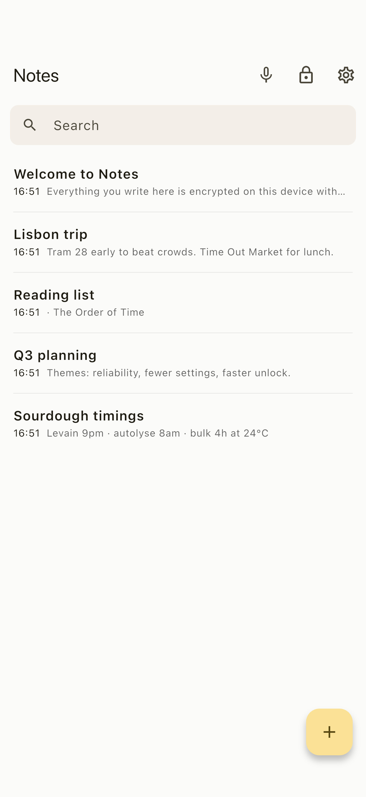
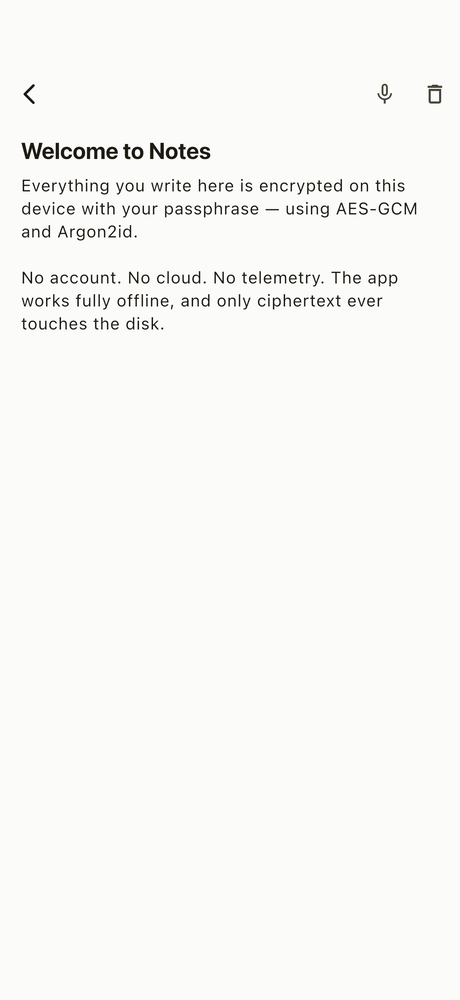

# Rune

**Private notes that never leave your device.** Rune keeps everything you write
encrypted on your phone with a passphrase only you know — no account, no cloud,
no sync, and not one network call. It feels like Apple Notes. It just doesn't
trust anyone with your data, and neither should you.

[](https://github.com/rorystandley/rune/actions/workflows/ci.yml)

<p align="center">
  <a href="https://apps.apple.com/us/app/rune-secure-notes/id6786366361"></a>
  &nbsp;&nbsp;
  <a href="https://play.google.com/store/apps/details?id=co.rorystandley.rune"></a>
</p>

<p align="center">
  
  &nbsp;&nbsp;&nbsp;
  
</p>

Open Rune and you get a calm, familiar notes app: a clean list, instant search,
a distraction-free editor. The difference is underneath. Every note is sealed
with authenticated encryption before it ever touches disk, so what's stored is
ciphertext and nothing else. Lose your phone and your notes are unreadable.
Forget your passphrase and not even the developer can get them back — there's no
backdoor, because there's no server to hide one on.

Rather talk than type? Dictate a note and both the recording *and* the
transcription run entirely on your device, using whisper.cpp. Your voice never
leaves the phone either.

> **Where it's at, honestly.** Rune is live on both stores and does what it says,
> but it's young and **not independently audited**. It leans on standard,
> well-reviewed cryptographic primitives — it implements none of its own — and
> the security-critical code is small and tested on every commit. If you're
> trusting it with high-stakes secrets, read [SECURITY.md](SECURITY.md) first: it
> spells out exactly what Rune protects against and what it doesn't.

## Why you'll like it

- **Encrypted by default, always.** A key derived from your passphrase with
  Argon2id, then XChaCha20-Poly1305 for every note. Only ciphertext reaches the
  disk, and the tests prove it.
- **No network, no accounts, no tracking.** No sign-up, no sync, no telemetry, no
  analytics, no crash reporting. Rune makes no network calls at all — airplane
  mode changes nothing.
- **Unlock your way.** Your passphrase, optionally backed by Face ID, Touch ID,
  or Windows Hello. Auto-locks when you're idle and when the app goes to the
  background.
- **Voice notes that stay put.** Record and transcribe locally with whisper.cpp.
  No upload, no third-party speech API.
- **Familiar and fast.** Two-pane on desktop, single-pane on mobile, with instant
  local search. If you've used Apple Notes, you already know how to use Rune.
- **Your data stays yours.** Encrypted backups you hold the key to, plus a
  deliberately guarded plaintext export for when you really want one.
- **Runs everywhere.** One codebase for iOS, Android, macOS, Windows, and Linux.
- **Open and checkable.** GPLv3, reproducible Android builds, and releases signed
  with cryptographic provenance anyone can verify.

---

## Under the hood

**Flutter with a pure-Dart core.** The same code runs on iOS, Android, macOS,
Windows, and Linux. Underneath, the app is split in two:

- **`packages/notes_core/`** holds *all* the crypto, storage, and note logic in
  **pure Dart**: no Flutter, no network, no logging of secrets. Because it never
  imports Flutter, its tests run under plain `dart test` with no device,
  emulator, or platform SDK. This is where the security lives, and where the
  security tests run.
- **`app/`** is a thin Flutter layer on top — screens, state, and platform glue
  (file paths, microphone) and nothing more.

The security code stays small and Flutter-free, so it's easy to read and review
on its own.

**Cryptography** is the [`cryptography`](https://pub.dev/packages/cryptography)
package, a pure-Dart implementation of standard primitives: **Argon2id** for key
derivation and **XChaCha20-Poly1305** for authenticated encryption. Rune writes
none of its own crypto. Full design and threat model in
[SECURITY.md](SECURITY.md).

### Envelope encryption

```
passphrase ──Argon2id(salt, 64 MiB, 3 passes)──▶ KEK (key-encryption key)
                                                  │
random 32-byte DEK (data key) ──encrypt with KEK─┘──▶ "wrapped key" (stored)

each note ──encrypt with DEK (XChaCha20-Poly1305, random nonce)──▶ .note file
```

- Your passphrase derives a **key-encryption key (KEK)** via Argon2id.
- A random **data-encryption key (DEK)** is generated once per vault and stored
  only in *wrapped* (encrypted-under-KEK) form.
- Notes are encrypted with the DEK.
- **Changing your passphrase only re-wraps the DEK** — notes are never
  re-encrypted, so the design never paints itself into a corner.
- A **wrong passphrase** produces a wrong KEK, which fails the wrapped key's
  authentication tag, and unlock is rejected. (Proven by tests.)
- Optional biometric / OS unlock caches the DEK in this device's platform
  credential store, and only after you opt in. Once enabled, platform
  authentication starts automatically on each locked session; the passphrase path
  is unchanged and always available.

### On-disk layout

```
<app-support>/notes_app/
├── vault/
│   ├── vault.json        # NON-secret header: KDF params + salt, cipher id, wrapped DEK
│   └── notes/
│       ├── 5f3a…1c.note  # AEAD blob: nonce || ciphertext || MAC  (filename = random id)
│       └── …
├── settings.json         # NON-secret: auto-lock timeout, toggles/bindings (no secrets)
└── audio_tmp/            # transient voice recordings (deleted by default)
```

Only ciphertext is ever written for note content, and writes are atomic
(temp-file + rename) to survive crashes. See
[what metadata remains visible](SECURITY.md#what-metadata-leaks).

### App layers

| Layer | Location | Responsibility |
|------|----------|----------------|
| Crypto | `notes_core/src/crypto` | Argon2id, XChaCha20-Poly1305, wrap/unwrap, secure RNG |
| Models | `notes_core/src/models` | `Note`, `VaultMetadata`, `KdfParams` |
| Storage | `notes_core/src/storage` | `VaultStore` interface + `FileVaultStore` |
| Services | `notes_core/src/services` | `VaultService`, `NotesRepository`, `ExportService` |
| Transcription | `notes_core/src/transcription` | `TranscriptionService`, WAV decode, whisper.cpp FFI (+ test-only stub) |
| Platform glue | `app/lib/platform` | app paths, microphone, optional OS-keystore unlock |
| State | `app/lib/state` | `AppController` (lock state machine, auto-lock) |
| UI | `app/lib/ui` | create/unlock/home/editor/settings, voice sheet |

---

## Setup, build, run

### Prerequisites

- Flutter SDK 3.44+ (Dart 3.12+). Install from <https://flutter.dev> or, on
  macOS, `brew install --cask flutter`.
- For device/desktop builds you also need the platform toolchain (Xcode for
  macOS/iOS, Android SDK for Android, GTK/CMake plus `libsecret-1-dev` for Linux,
  Visual Studio for Windows). **None of these are needed to run the tests.**

### Get the source

Rune vendors whisper.cpp as a git submodule for the on-device transcription
native build (macOS/Android/iOS). Clone with submodules, or initialise them after
a plain clone:

```bash
git clone --recurse-submodules https://github.com/rorystandley/rune.git
# or, after a plain clone:
git submodule update --init --recursive
```

The submodule is only needed to build the native transcription library; the test
suite and `flutter analyze` run without it.

### Get dependencies

```bash
# Core package (pure Dart)
cd packages/notes_core && dart pub get && cd -

# Flutter app
cd app && flutter pub get
```

### Run the app

```bash
cd app
flutter run                 # pick a connected device / running desktop target
flutter run -d macos        # example: macOS desktop (requires Xcode)
flutter run -d linux        # example: Linux desktop
```

### Build a release

```bash
cd app
flutter build macos         # or: ios, apk, appbundle, linux, windows
```

> Rune targets all five platforms. On a headless CI box with no Xcode / Android
> SDK you can still run the full test suite (below) and `flutter analyze`; you
> just can't produce device binaries there.

---

## Testing

The security properties are covered by tests. Run them yourself:

```bash
# Core security + logic tests (no Flutter needed)
cd packages/notes_core && dart test

# App state + widget tests
cd app && flutter test
```

What's covered — encryption round-trips, wrong-passphrase rejection, CRUD,
search, export behaviour, no-plaintext-at-rest, no-secret-logging — is described
in [TESTING.md](TESTING.md).

These same checks (`dart analyze` + `dart test` for the core, `flutter analyze` +
`flutter test` for the app) run in
[GitHub Actions](.github/workflows/ci.yml) on every push and pull request, so the
security tests pass publicly on each commit (see the CI badge above).

---

## What works today, what's next

### Done and tested
- First-launch vault creation with a passphrase and an irreversibility warning.
- Lock / unlock; the app starts locked if a vault exists; manual lock; auto-lock
  on inactivity; lock-on-background.
- Optional Face ID / Touch ID / Windows Hello unlock, off by default, caching only
  the vault DEK behind the platform credential store and prompting automatically
  after opt-in.
- Argon2id + XChaCha20-Poly1305 envelope encryption; encrypted at rest.
- A wrong passphrase cannot decrypt (test-proven).
- Notes: create, edit (autosave), delete, list, local search.
- Encrypted backup export; plaintext export gated behind explicit confirmation.
- Settings screen with the privacy posture, auto-lock, and change-passphrase.
- Responsive Apple-Notes-style UI (two-pane desktop, single-pane mobile).
- Voice-note flow: record locally → transcribe on-device → insert into a note →
  **delete the raw audio by default**.

### On-device speech-to-text
Audio *recording* is real (`record`, 16 kHz mono WAV). Transcription runs locally
through whisper.cpp via Dart FFI with a bundled quantized English model:

- **macOS** — via the bundled dylib.
- **Android** — the same whisper.cpp bridge, verified on a Samsung Galaxy A53
  (Android 15, arm64) transcribing the bundled JFK sample.
- **iOS** — the bridge linked as a force-loaded static library and resolved with
  `DynamicLibrary.process()`, verified on a physical iPhone (iOS 26, arm64)
  transcribing a real recording.
- **Windows / Linux** — no bundled engine yet, so the voice-note flow is disabled
  there rather than inserting placeholder text. See
  [docs/transcription.md](docs/transcription.md).

### Not done yet (see [ROADMAP.md](ROADMAP.md))
- Native file picker / share sheet for exports (currently saved to a documented
  path).
- Optional native crypto acceleration (`cryptography_flutter`) for faster
  Argon2id on mobile.
- Metadata hardening (size padding), encrypted attachments.

---

## Privacy at a glance

- **No** telemetry, analytics, crash reporting, or tracking.
- **No** network calls in normal use. No account, no cloud, no third parties.
- Flutter's own tooling analytics were disabled during development
  (`flutter --disable-analytics`); the app ships no analytics of any kind.

Full commitments: [PRIVACY.md](PRIVACY.md). Threat model and limits:
[SECURITY.md](SECURITY.md).

## Verifying a release

Released builds carry cryptographic provenance you can check against this repo:
SLSA build-provenance attestations on every artifact, plus a keyless cosign
signature over `SHA256SUMS`. Copy-paste verification commands (`gh attestation
verify`, `cosign verify-blob`, `sha256sum -c`) are in
[RELEASE.md → Verifying a release](RELEASE.md#verifying-a-release).

## License

Licensed under the **GNU General Public License v3.0** — see [LICENSE](LICENSE).

Copyright © 2026 Rory Standley.

This is free software: you may redistribute and/or modify it under the terms of
the GPLv3. It comes with **no warranty**. Contributions are welcome — see
[CONTRIBUTING.md](CONTRIBUTING.md), which covers how contributions interact with
app-store distribution. Distribution/packaging notes live in
[RELEASE.md](RELEASE.md).
